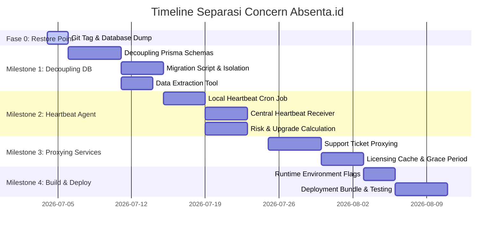

# 001 - ROADMAP SEPARASI CONCERN (TENANT VS PLATFORM)

Dokumen ini mendefinisikan peta jalan besar (*grand roadmap*) untuk memisahkan domain operasional lokal sekolah (Tenant/On-Premise) dengan domain administrasi platform (Platform/Central SaaS) pada **Project Absenta**.

---

## 1. Sasaran Utama (Key Goals)

1. **Otonomi Lokal 100%**: Instans lokal sekolah (on-premise) wajib terus berjalan untuk kegiatan esensial (KBM, Absensi RFID, POS Koperasi, BK) tanpa membutuhkan koneksi internet konstan.
2. **Visibilitas Sentral Terjaga**: Platform owner (SaaS) tetap dapat memantau metrik kesehatan, risiko churn (*Risk Score*), status lisensi, dan keluhan tiket secara terpusat.
3. **Isolasi Data Kepatuhan**: Database lokal sekolah hanya menyimpan data internal sekolah. Data penagihan, lisensi, dan monitoring infrastruktur diisolasi di server pusat.
4. **Keamanan Pembalikan Status (Safe Reversion)**: Menyediakan jaminan titik pemulihan (*restore point*) kode dan data untuk kembali ke keadaan SaaS terintegrasi semula jika proses migrasi gagal.

---

## 2. Peta Jalan & Milestones (Milestones Roadmap)



### 📍 Fase 0: Restore Point & Safe Reversion Protocol (Fase Pengamanan)
Sebelum memulai modifikasi kode atau skema, langkah pengamanan wajib dijalankan untuk menjamin sistem dapat dikembalikan ke state awal.
* [ ] **Git Restore Point Creation**:
  - Simpan state kerja saat ini ke branch cadangan baru:
    ```bash
    git checkout -b restorepoint/pre-separation-state
    git push origin restorepoint/pre-separation-state
    ```
  - Buat tag rilis lokal:
    ```bash
    git tag -a pre-separation-v1.0.2 -m "Restore point before separating tenant and platform modules"
    ```
* [ ] **Database Schema & Dump Snapshot**:
  - Salin berkas `prisma/schema.prisma` ke lokasi aman di luar repositori (misal: `docs/architecture/backups/schema.prisma.bak`).
  - Lakukan backup database PostgreSQL utuh (struktur & data) menggunakan pg_dump:
    ```bash
    pg_dump -h localhost -U postgres -d absenta_db -F c -b -v -f "docs/architecture/backups/absenta_pre_separation.backup"
    ```
* [ ] **Prosedur Rollback Segera (Emergency Revert)**:
  - Jika proses pemisahan gagal atau mengalami anomali di tengah jalan, jalankan perintah rollback berikut:
    ```bash
    # 1. Checkout kembali ke branch restorepoint
    git reset --hard
    git checkout restorepoint/pre-separation-state
    
    # 2. Hapus database yang rusak dan restore database awal
    dropdb -h localhost -U postgres absenta_db
    createdb -h localhost -U postgres absenta_db
    pg_restore -h localhost -U postgres -d absenta_db -v "docs/architecture/backups/absenta_pre_separation.backup"
    ```

---

### 📍 Milestone 1: Decoupling Schema & Database Isolation (Fase Persiapan)
Fokus pada memecah skema database Prisma yang menyatu agar instans lokal on-premise memiliki database yang bersih dari data platform.
* [ ] **Pemisahan Berkas Prisma Schema**:
  - Pecah `schema.prisma` menjadi `schema.local.prisma` (operasional sekolah) dan `schema.central.prisma` (SaaS billing & platform data).
* [ ] **Pembersihan Tabel Database Lokal**:
  - Buat skrip migrasi untuk menghapus tabel platform (`PlatformMetrics`, `TenantRefundRecord`, `Subscription`) dari instans sekolah.
* [ ] **Definisi Model Relasional Transisional**:
  - Menghilangkan relasi foreign key database antara tabel lokal (seperti `Tenant`) dengan tabel pusat, dan menggantinya dengan referensi ID logis (`tenant_id` string).
* [ ] **Pembuatan Ekstraktor Data Sekolah (Data Migration Tool)**:
  - Membuat skrip mengekspor data berdasarkan `tenant_id` tertentu menjadi format file JSON terenkripsi untuk kebutuhan seeding data sekolah ke server lokal baru.

---

### 📍 Milestone 2: Heartbeat & Monitoring Agent (Fase Pemantauan)
Menghubungkan instans lokal dengan pusat agar platform owner tidak kehilangan visibilitas bisnis dan teknis.
* [ ] **Pengembangan Agen Heartbeat Lokal**:
  - Implementasi cron job `heartbeatSync` di server lokal untuk mengumpulkan metrik performa (ukuran DB, latensi, CPU) dan data keaktifan (jumlah guru/siswa aktif, tap terakhir).
* [ ] **Pembangunan Receiver di Server Pusat**:
  - Menyediakan endpoint secure `/platform/heartbeat` di server SaaS pusat untuk menerima payload heartbeat dari seluruh instans on-premise.
* [ ] **Integrasi Risk & Upgrade Engine**:
  - Memasok data heartbeat yang diterima ke modul `risk` dan `upgrade-intelligence` pusat untuk kalkulasi skor risiko churn secara otomatis.
* [ ] **Autentikasi Server Lokal (API Key Handshake)**:
  - Membuat sistem pembagian API Key terenkripsi untuk setiap server on-premise guna memverifikasi integritas payload heartbeat ke pusat.

---

### 📍 Milestone 3: Proxying & Desentralisasi Layanan (Fase Integrasi)
Menghubungkan modul yang bersumber dari pusat (seperti helpdesk support dan verifikasi lisensi) melalui jaringan API.
* [ ] **Proxy Tiket Bantuan (Support Ticket)**:
  - Mengubah modul `support-ticket` lokal menjadi client-side API. Pengajuan tiket dari admin lokal sekolah otomatis diteruskan via `axios` ke server pusat.
* [ ] **Lisensi & Entitlements Fallback**:
  - Menyelaraskan modul `billing` lokal untuk mem-proxy pengecekan ke server lisensi pusat secara berkala.
  - Menerapkan mekanisme **7-day Grace Period** (menggunakan cache lisensi terakhir) jika server lokal terputus dari internet.
* [ ] **Local Storage Driver Configuration**:
  - Menyediakan variabel config `STORAGE_DRIVER` (`LOCAL` vs `S3`). Mengarahkan penyimpanan foto dan dokumen logistik ke harddisk lokal untuk mengurangi ketergantungan internet.

---

### 📍 Milestone 4: Build Optimization & Deployment (Fase Rilis)
Memisahkan proses build dan optimasi bundel instalasi untuk kedua lingkungan server yang berbeda.
* [ ] **Runtime Environment Setup**:
  - Konfigurasi runtime parameter `DEPLOYMENT_MODE` (`ON_PREMISE` vs `CENTRAL_SAAS`) pada kode backend.
  - Memastikan modul platform-only tidak diregistrasikan di server lokal saat mode `ON_PREMISE` aktif.
* [ ] **Manajemen Pembaruan Aplikasi (Auto Updates)**:
  - Mengatur worker pembaruan sistem di instans lokal sekolah agar melakukan *pull check* berkala ke server pusat, mengunduh rilis kode baru, dan melakukan restart PM2 secara otomatis.
* [ ] **Frontend Route Hardening & Tree Shaking**:
  - Konfigurasi `VITE_DEPLOY_MODE` (`ON_PREMISE` vs `CENTRAL_SAAS`) pada berkas `.env` dan router utama React (`App.tsx` / `routes.tsx`).
  - Mengubah import halaman superadmin menjadi dynamic lazy imports agar terpotong secara otomatis oleh bundler Vite (Rollup) saat build lokal sekolah.
* [ ] **Setup Bundel Rilis**:
  - Membuat konfigurasi deployment terpisah (Docker compose lokal vs setup PM2 cloud platform).
  - Melakukan pengujian integrasi offline-online.

---

## 3. Matriks Dampak File (Affected Code Map)

| Modul / Komponen | File yang Perlu Dimodifikasi | Perubahan yang Diperlukan |
| :--- | :--- | :--- |
| **Prisma Schema** | `prisma/schema.prisma` | Dipecah menjadi dua file skema terpisah. |
| **Module Loading** | `src/app.ts` atau `src/main.ts` | Filter registrasi modul berdasarkan `DEPLOYMENT_MODE`. |
| **Heartbeat Sync** | `src/modules/system-config/services/heartbeat.service.ts` [NEW] | Service untuk cron job pengumpulan data metrik lokal. |
| **Support Ticket** | `src/modules/support-ticket/controllers/support-ticket.controller.ts` | Ubah endpoint tulis/baca tiket lokal agar mem-proxy ke pusat. |
| **License Check** | `src/modules/billing/services/license.service.ts` | Tambahkan durasi fallback Grace Period lokal. |
| **Storage Service**| `src/services/storage.service.ts` | Konfigurasi driver upload ke disk lokal sekolah. |
| **Frontend Router** | `absenta_frontend/src/App.tsx` | Filter rute superadmin dinamis menggunakan `VITE_DEPLOY_MODE` dan lazy loading. |
