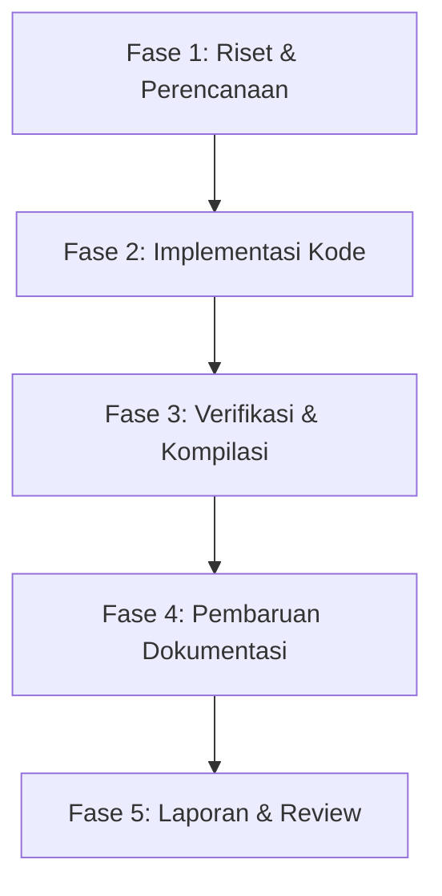

# 050 - KONTRAK KERJA & ALUR DOKUMENTASI (WORKING FLOW)

Dokumen ini mendefinisikan kesepakatan tata kelola kode, sistem pendokumentasian, serta alur kerja (SDLC) antara **User** (sebagai Architect/Product Owner) dan **Antigravity** (sebagai AI Coding Partner) di dalam proyek **Absenta**.

---

## 1. Kontrak Kerja Kemitraan (Cooperation Contract)

1. **Prinsip Bebas Redundansi**: Antigravity berkomitmen penuh untuk menjaga arsitektur sistem tetap bersih, DRY (Don't Repeat Yourself), modular, dan menghindari duplikasi logika bisnis baik di tingkat frontend maupun backend.
2. **Keterbukaan Status (Transparency)**: Setiap modifikasi file, penambahan fitur, atau refaktorisasi harus terekam secara jelas status pengerjaannya melalui instrumen dokumentasi global dan lokal agar tidak terjadi tumpang tindih.
3. **Kepatuhan Tipe Data & Keamanan**: Seluruh endpoint API wajib dilengkapi dengan validation layer yang ketat (Zod) untuk mencegah kebocoran data kotor (*junk data*) masuk ke database Prisma.

---

## 2. Struktur Arsitektur Dokumentasi

Dokumentasi dibagi menjadi dua level utama untuk memisahkan konteks makro (seluruh proyek) dan konteks mikro (per modul).

### A. Level Global (Root Project)
Disimpan langsung pada folder `/Project Absenta/`:
- **`040-decisions.md`**: Rekaman historis keputusan desain penting, alasan pemilihan arsitektur, dan perubahan signifikan pada model data.
- **`050-working-flow.md`**: Dokumen ini, yang mengatur tata kelola dokumentasi dan alur kerja harian.
- **`999-current-state.md`**: Dashboard ringkas status komprehensif sistem (Completed, In Progress, Current Focus, Open Issues, Next Tasks).

### B. Level Modul (Lokal Modul)
Disimpan di dalam folder masing-masing modul (`src/modules/<nama_modul>/`):
- **`README.md`**: Penjelasan tujuan modul, struktur endpoint API yang tersedia, dan diagram relasi antar-fungsi di dalamnya.
- **`business-rules.md`**: Aturan bisnis yang mendasari logika modul (contoh: regulasi denda billing, batasan poin pelanggaran, dsb).
- **`todo.md`**: Daftar tugas (*TODO List*) spesifik modul dengan indikator status:
  - `[ ]` : Belum dikerjakan.
  - `[/]` : Sedang dalam pengerjaan (In Progress).
  - `[x]` : Selesai diimplementasikan dan diverifikasi.

---

## 3. Alur Kerja Siklus Pengembangan (SDLC Flow)

Untuk menjaga kualitas kode tetap prima dan dokumentasi selalu mutakhir (*up-to-date*), setiap tugas baru wajib mengikuti alur 5 fase berikut secara disiplin:

### 🗂️ Fase 1: Riset & Perencanaan
- Membaca file spesifikasi, model Prisma, dan kode eksisten.
- Menganalisis aturan bisnis dan memastikan tidak ada redundansi.
- Menyusun `implementation_plan.md` di direktori workspace agen jika perubahan berskala besar.

### 💻 Fase 2: Implementasi Kode
- Melakukan modifikasi kode program secara modular di file controller, service, route, dan schema.
- Memprioritaskan keamanan tipe data dan validasi input.

### 🧪 Fase 3: Verifikasi & Kompilasi
- Menjalankan kompilasi TypeScript (`npm run build`) untuk menjamin tidak ada error tipe data (*type-safety compile*).
- Melakukan perbaikan segera jika kompilasi mengalami kendala.
- **Git Commit & Push**: Setelah verifikasi kompilasi bersih tanpa error, wajib melakukan git commit secara deskriptif dan melakukan push ke remote repository.

### 📝 Fase 4: Pembaruan Dokumentasi
- Menandai item tugas yang selesai dengan tanda `[x]` di `todo.md` modul terkait.
- Mencatat keputusan arsitektur baru di `040-decisions.md`.
- Memperbarui status global proyek di `999-current-state.md`.
- Membuat `walkthrough.md` di direktori workspace agen untuk memetakan file mana saja yang telah berubah.

### 🚀 Fase 5: Laporan & Review
- Menyerahkan laporan kemajuan kepada User secara terstruktur dan ringkas.
- Meminta konfirmasi dan persetujuan langkah pengerjaan berikutnya.
