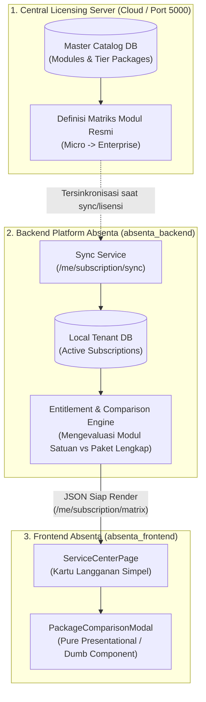

# Rencana Arsitektur: Dynamic Package Comparison Matrix (Entitlement & Matrix Resolution)

Dokumen ini menganalisis dan merancang penempatan logika **Matriks Komparasi Paket & Modul Dinamis**: apakah sebaiknya diolah di **Backend Server Lisensi**, **Backend Platform Absenta (Tenant SaaS)**, atau **Frontend**.

---

## 1. Analisis Opsi Arsitektur

Berikut perbandingan 3 opsi arsitektur:

| Kriteria | Opsi A: Server Lisensi (Central Authority) | Opsi B: Backend Platform Absenta (Tenant Backend) | Opsi C: Hybrid (Direkomendasikan) |
| :--- | :--- | :--- | :--- |
| **Lokasi Logika** | Server Lisensi pusat (Port 5000 / API License) | Backend lokal tenant (`absenta_backend`) | Master Matrix di Lisensi, Entitlement di Backend Tenant, Frontend tinggal render |
| **Single Source of Truth** | ⭐⭐⭐ **Tertinggi** (Perubahan tier/fitur otomatis berlaku ke semua sekolah) | ⭐ Terfragmentasi (Harus update migration di setiap tenant) | ⭐⭐⭐ **Sangat Tinggi** (Pusat memegang catalog, tenant mengevaluasi lisensi aktif) |
| **Ketahanan Jaringan (Offline/Hybrid)** | ⚠️ Rentan jika koneksi ke server lisensi lambat atau offline | ⭐⭐ Aman karena data ada di SQLite/PostgreSQL lokal | ⭐⭐⭐ **Paling Aman** (Bisa disinkronkan saat online, dan di-cache lokal) |
| **Beban Frontend** | ⭐⭐⭐ Frontend 100% *Dumb/Pure Render* | ⭐⭐⭐ Frontend 100% *Dumb/Pure Render* | ⭐⭐⭐ Frontend 100% *Dumb/Pure Render* |

---

## 2. Arsitektur yang Direkomendasikan: Opsi C (Hybrid Single Source of Truth)



### Mengapa Opsi C Paling Tepat?
1. **Pemisahan Peran yang Bersih (Separation of Concerns):**
   * **Server Lisensi:** Menentukan *apa aturan produknya* (Modul apa yang ada di Small, Medium, Large, Enterprise).
   * **Backend Platform Tenant:** Menentukan *apa yang sedang dimiliki oleh tenant ini* (Apakah tenant hanya membeli Absensi Small? Atau punya Paket Lengkap Enterprise?).
   * **Frontend:** Tidak memiliki *hardcoded business logic*, hanya bertugas me-render tabel secara dinamis.
2. **Menjawab Kebutuhan Modul Satuan vs Paket Lengkap:**
   * Jika tenant membeli **Modul Satuan (misal: Absensi Varian Small)**:
     Backend menghasilkan status modul:
     * `ABSENSI`: `status: "ACTIVE"`, `owned: true`, `source: "Aplikasi Absensi"`
     * `ACADEMIC`: `status: "NOT_INCLUDED"`, `owned: false`
     * `KESISWAAN`: `status: "NOT_INCLUDED"`, `owned: false`
     * `SARPRAS`: `status: "NOT_INCLUDED"`, `owned: false`
   * Jika tenant membeli **Paket Lengkap**:
     * Seluruh modul yang masuk di tier tersebut bernilai `owned: true` dan `source: "Paket Lengkap"`.

---

## 3. Desain Kontrak Data (API Contract DTO)

Endpoint baru atau perluasan pada `/me/subscription/overview` / `/me/subscription/matrix`:

```json
{
  "success": true,
  "data": {
    "active_context": {
      "plan_type": "STANDALONE_MODULE",
      "primary_name": "Aplikasi Absensi",
      "variant": "Small",
      "max_user": 300
    },
    "columns": [
      { "id": "ABSENSI", "name": "Absensi Multi-Sesi", "icon": "Building2" },
      { "id": "ACADEMIC", "name": "Akademik & Kurikulum", "icon": "BookOpen" },
      { "id": "KESISWAAN", "name": "Kesiswaan & BP/BK", "icon": "Users" },
      { "id": "SARPRAS", "name": "Sarpras & Aset", "icon": "Package" },
      { "id": "HUBIN", "name": "Hubin & PKL", "icon": "Briefcase" },
      { "id": "KOPERASI", "name": "Koperasi Digital", "icon": "Wallet" },
      { "id": "WHATSAPP", "name": "WhatsApp Gateway", "icon": "MessageSquare" },
      { "id": "EASY_TUNNEL", "name": "Easy Tunnel VPN", "icon": "ShieldCheck" }
    ],
    "tiers": [
      {
        "tier": "Small",
        "capacity": "300 Pengguna",
        "is_tenant_current_tier": true,
        "modules": {
          "ABSENSI": { "included_in_tier": true, "owned_by_tenant": true, "badge": "Aktif" },
          "ACADEMIC": { "included_in_tier": true, "owned_by_tenant": false, "badge": "Tersedia di Paket Lengkap" },
          "KESISWAAN": { "included_in_tier": true, "owned_by_tenant": false, "badge": "Tersedia di Paket Lengkap" },
          "SARPRAS": { "included_in_tier": false, "owned_by_tenant": false, "badge": "Tidak Termasuk" },
          "HUBIN": { "included_in_tier": false, "owned_by_tenant": false, "badge": "Tidak Termasuk" },
          "KOPERASI": { "included_in_tier": false, "owned_by_tenant": false, "badge": "Tidak Termasuk" },
          "WHATSAPP": { "included_in_tier": false, "owned_by_tenant": false, "badge": "Tidak Termasuk" },
          "EASY_TUNNEL": { "included_in_tier": false, "owned_by_tenant": false, "badge": "Tidak Termasuk" }
        }
      }
    ]
  }
}
```

---

## 4. Rencana Tahapan Eksekusi (Implementation Steps)

### Tahap 1: Backend Platform Absenta (Engine Resolusi)
1. Buat service / helper `PackageMatrixResolver` di `absenta_backend/src/modules/billing/services/package-matrix.service.ts`.
2. Helper memetakan:
   - Definisi default tier (*Micro, Small, Medium, Large, Enterprise*).
   - Seluruh langganan aktif tenant (`allSubscriptions` & `features_json`).
   - Logika penentuan centang:
     - Jika diklik dari modul satuan -> hanya modul tersebut yang berstatus `owned_by_tenant: true`.
     - Jika diklik dari Paket Lengkap -> semua modul tier tersebut berstatus `owned_by_tenant: true`.
3. Buka endpoint `GET /me/subscription/matrix?service_id=:id` atau sertakan dalam `getMySubscriptionOverviewQuery`.

### Tahap 2: Frontend Refactor (Pure Dumb Renderer)
1. Ubah `PackageComparisonModal.tsx`:
   - Menerima payload matriks dari backend (atau menggunakan helper frontend dinamis sebagai *graceful fallback* bila offline).
   - Render centang berdasarkan `owned_by_tenant` dan `included_in_tier`.
   - Modul yang tidak dimiliki diberi tanda strip atau gembok dengan tooltip informasi.

### Tahap 3: Validasi & Testing End-to-End
1. Uji skenario **Tenant Demo dengan Modul Satuan** (misal hanya Absensi Small):
   - Buka Detail Paket -> Pastikan hanya kolom Absensi yang tercentang hijau di baris Small.
2. Uji skenario **Tenant dengan Paket Lengkap**:
   - Buka Detail Paket -> Pastikan seluruh kolom yang tercakup di tier tersebut tercentang hijau.
3. Jalankan `npx tsc --noEmit` & `node ./scripts/audit-pages.cjs`.
