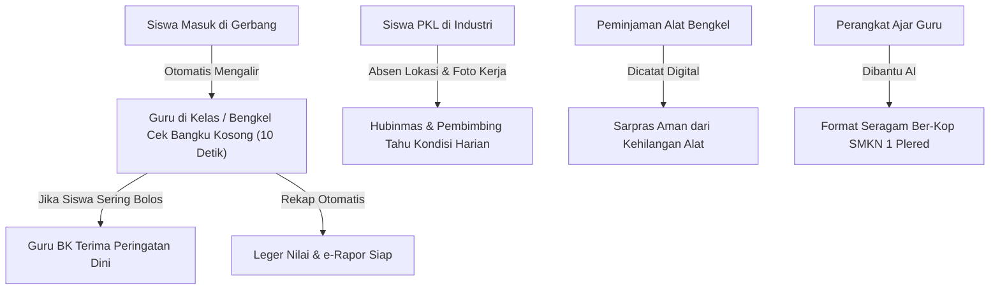

# 📄 PROPOSAL PENGAJUAN IMPLEMENTASI PLATFORM ABSENTA
## Solusi Terpadu Pengelolaan Sekolah, Peningkatan Disiplin Siswa, dan Pengurangan Beban Administrasi Guru di SMKN 1 Plered

---

**Nomor Dokumen:** 002/PROP-ABSENTA/SMKN1PLD/2026  
**Hal:** Usulan Penerapan Sistem Manajemen Sekolah Terpadu (Platform Absenta)  
**Pengusul:** Tim Pengembang & Inovasi Internal SMKN 1 Plered  
**Ditujukan Kepada:**  
Yth. **Kepala SMKN 1 Plered**  
cc. **Wakil Kepala Sekolah (Kurikulum, Kesiswaan, Hubinmas, Sarpras), Kepala Tata Usaha, dan Koordinator BP/BK**  

---

## LEMBAR PENGESAHAN & PERSETUJUAN

Proposal ini disusun berdasarkan pengamatan langsung terhadap rutinitas harian di SMKN 1 Plered guna mencari solusi praktis atas kendala operasional yang dihadapi bapak/ibu guru dan manajemen sekolah:

| Unsur / Bidang | Jabatan | Paraf & Tanggal |
| :--- | :--- | :--- |
| **Pengusul** | Tim Inovasi Internal Absenta | ................................... |
| **Waka Kurikulum** | Urusan KBM, Perangkat Ajar & Pembagian Jam | ................................... |
| **Waka Kesiswaan** | Urusan Disiplin, Tata Tertib & Ketidakhadiran | ................................... |
| **Waka Hubinmas** | Urusan PKL, Hubungan Industri & BKK | ................................... |
| **Waka Sarpras** | Urusan Alat Praktik Bengkel/Lab & Fasilitas | ................................... |
| **Koordinator BP/BK** | Urusan Pendampingan & Pembinaan Siswa | ................................... |
| **Ketua Koperasi** | Urusan Toko Sekolah & Simpan Pinjam Guru | ................................... |
| **Menyetujui:** | **Kepala SMKN 1 Plered** | ................................... |

---

## DAFTAR ISI
1. [Ringkasan Masalah & Solusi (Bagi Pimpinan)](#1-ringkasan-masalah--solusi-bagi-pimpinan)
2. [Latar Belakang: Masalah Nyata Sehari-hari di Lapangan SMKN 1 Plered](#2-latar-belakang-masalah-nyata-sehari-hari-di-lapangan-smkn-1-plered)
   - [2.1. Masalah Presensi Gerbang: Antrean dan Kepastian Siswa Sampai di Sekolah](#21-masalah-presensi-gerbang-antrean-dan-kepastian-siswa-sampai-di-sekolah)
   - [2.2. Masalah Presensi Kelas & Bengkel: Fenomena "Hadir Pagi, Hilang di Jam Siang"](#22-masalah-presensi-kelas--bengkel-fenomena-hadir-pagi-hilang-di-jam-siang)
   - [2.3. Masalah Kurikulum: Guru Habis Waktu Mengetik Berkas Administrasi](#23-masalah-kurikulum-guru-habis-waktu-mengetik-berkas-administrasi)
   - [2.4. Masalah Akademik & Nilai: Rumus Excel Rusak dan Bentrok Ruang Bengkel](#24-masalah-akademik--nilai-rumus-excel-rusak-dan-bentrok-ruang-bengkel)
   - [2.5. Masalah Kesiswaan: Catatan Pelanggaran Tercecer di Kertas Sobekan](#25-masalah-kesiswaan-catatan-pelanggaran-tercecer-di-kertas-sobekan)
   - [2.6. Masalah BP/BK: Penanganan Siswa Sering Terlambat / "Kebakaran Jenggot"](#26-masalah-bpbk-penanganan-siswa-sering-terlambat--kebakaran-jenggot)
   - [2.7. Masalah PKL (Hubin): Ratusan Siswa di Luar Sekolah Sulit Dipantau](#27-masalah-pkl-hubin-ratusan-siswa-di-luar-sekolah-sulit-dipantau)
   - [2.8. Masalah Sarpras: Alat Praktik Bengkel Sering Rusak/Hilang Tanpa Jejak](#28-masalah-sarpras-alat-praktik-bengkel-sering-rusakhilang-tanpa-jejak)
   - [2.9. Masalah Koperasi: Antrean Seragam yang Semrawut dan Pembukuan Manual](#29-masalah-koperasi-antrean-seragam-yang-semrawut-dan-pembukuan-manual)
   - [2.10. Tampilan Lobi & Cetak Berkas: Informasi Sekolah Modern dan Rapi](#210-tampilan-lobi--cetak-berkas-informasi-sekolah-modern-dan-rapi)
3. [Solusi Platform Absenta: Sistem yang Saling Menyambung Otomatis](#3-solusi-platform-absenta-sistem-yang-saling-menyambung-otomatis)
4. [Manfaat Nyata bagi Manajemen, Guru, dan Orang Tua](#4-manfaat-nyata-bagi-manajemen-guru-dan-orang-tua)
5. [Rencana Uji Coba (Pilot Project) 30 Hari Tanpa Risiko](#5-rencana-uji-coba-pilot-project-30-hari-tanpa-risiko)
6. [Kebutuhan Perangkat & Efisiensi Anggaran](#6-kebutuhan-perangkat--efisiensi-anggaran)
7. [Penutup & Harapan](#7-penutup--harapan)

---

## 1. RINGKASAN MASALAH & SOLUSI (BAGI PIMPINAN)

Bapak Kepala Sekolah dan jajaran manajemen yang kami hormati,

Sebagai bagian dari warga SMKN 1 Plered yang bertugas di lapangan setiap hari, kami merasakan bahwa saat ini beban kerja bapak/ibu guru dan staf sekolah sangat berat. Sebagian besar waktu guru dan staf habis bukan untuk membimbing siswa, melainkan untuk urusan pencatatan manual:
- Guru sibuk memanggil absen satu per satu di setiap pergantian jam.
- Guru kelelahan menyusun berkas kurikulum hingga larut malam.
- Sekolah kesulitan memastikan apakah siswa yang magang/PKL benar-benar masuk di bengkel/pabrik rekanan.
- Guru BK sering baru tahu ada siswa yang sering bolos ketika masalahnya sudah terlanjur parah.
- Alat-alat praktik di bengkel rawan hilang atau rusak karena catatan peminjamannya masih di buku kertas yang mudah terselip.

**Platform Absenta** hadir sebagai gagasan mandiri dari kami—warga internal sekolah—untuk menyelesaikan persoalan-persoalan di atas secara tuntas. Inti dari sistem ini sederhana: **membuat semua pencatatan sekolah saling terhubung secara otomatis lewat HP atau komputer, sehingga guru tidak perlu mencatat dobel dan pimpinan sekolah bisa melihat kondisi sekolah secara langsung kapan saja.**

---

## 2. LATAR BELAKANG: MASALAH NYATA SEHARI-HARI DI LAPANGAN SMKN 1 PLERED

Berikut adalah fakta-fakta nyata di lapangan yang menjadi alasan mendasar mengapa setiap bagian di dalam sistem ini sangat dibutuhkan oleh SMKN 1 Plered:

---

### 2.1. Masalah Presensi Gerbang: Antrean dan Kepastian Siswa Sampai di Sekolah

* **Kondisi di Lapangan:**  
  Setiap pagi antara pukul 06.30 hingga 07.00 WIB, ratusan siswa datang hampir bersamaan di gerbang depan. Jika absensi dilakukan manual dengan tanda tangan atau alat scanner yang lambat, antrean siswa langsung mengular panjang hingga ke tepi jalan raya. Akibatnya, banyak siswa yang sebenarnya sudah sampai di gerbang tetap tercatat terlambat. Selain itu, orang tua di rumah sering cemas karena tidak ada kabar pasti apakah anaknya benar-benar sudah tiba di sekolah atau mampir di tempat lain.
* **Solusi Sederhana Absenta:**  
  Siswa cukup menempelkan kartu (atau scan cepat) di gerbang dalam waktu kurang dari 1 detik. Jam kedatangan tercatat rapi secara otomatis, antrean gerbang lancar, dan sekolah memegang data pasti siapa saja yang sudah berada di dalam lingkungan sekolah sejak pagi.

---

### 2.2. Masalah Presensi Kelas & Bengkel: Fenomena "Hadir Pagi, Hilang di Jam Siang"

* **Kondisi di Lapangan:**  
  Ini adalah fenomena yang paling sering terjadi: siswa datang pagi-pagi di gerbang agar tidak dihukum piket, tetapi setelah istirahat pertama atau saat jam pelajaran siang di bengkel/kelas, siswa tersebut menghilang (nongkrong di kantin, bersembunyi di sudut sekolah, atau lompat pagar).  
  Di sisi lain, guru mata pelajaran harus membuang waktu 10 sampai 15 menit di awal jam pelajaran hanya untuk memanggil absen 36 siswa satu per satu dari buku kertas. Waktu belajar yang harusnya efektif jadi terbuang sia-sia.
* **Solusi Sederhana Absenta:**  
  Data siswa yang sudah masuk gerbang otomatis muncul di HP guru yang mengajar di jam tersebut. Guru tidak perlu memanggil semua nama, cukup melirik bangku yang kosong selama 10 detik. Jika ada siswa yang pagi ada di gerbang tetapi siang tidak ada di kelas, sistem langsung memberi tanda. Celah siswa untuk bolos di tengah hari langsung tertutup.

---

### 2.3. Masalah Kurikulum: Guru Habis Waktu Mengetik Berkas Administrasi

* **Kondisi di Lapangan:**  
  Dengan adanya Kurikulum Merdeka, bapak/ibu guru dibebani kewajiban menyusun begitu banyak dokumen: Capaian Pembelajaran (CP), Alur Tujuan Pembelajaran (ATP), Modul Ajar, Program Tahunan (PROTA), Program Semester (PROMES), hingga instrumen Projek P5. Banyak guru mengeluh kelelahan karena harus mengetik dan mengedit berkas-berkas ini hingga larut malam. Akhirnya, banyak berkas yang hanya sekadar salin-tempel dari internet dan sering kali tidak sesuai dengan alat praktik kejuruan yang ada di SMKN 1 Plered.
* **Solusi Sederhana Absenta:**  
  Sistem menyediakan asisten cerdas otomatis. Guru cukup memilih mata pelajaran, fase kelas, dan materi pokok; sistem langsung membantu merapikan draf Modul Ajar dan perangkat kurikulum lengkap dengan format dan Kop Surat resmi SMKN 1 Plered. Guru menghemat waktu hingga berjam-jam dan bisa kembali fokus mendidik siswa.

---

### 2.4. Masalah Akademik & Nilai: Rumus Excel Rusak dan Bentrok Ruang Bengkel

* **Kondisi di Lapangan:**  
  Di SMK, ruang bengkel praktik mesin, bengkel otomotif, dan lab komputer jumlahnya terbatas. Jadwal yang dibuat manual di lembar Excel sering kali membuat dua guru menggunakan ruangan yang sama di jam yang sama.  
  Selain itu, setiap akhir semester, wali kelas selalu stres mengolah lembar leger nilai dari belasan guru mata pelajaran. Sering terjadi rumus rata-rata di Excel terhapus atau tertukar, sehingga pengesahan nilai dan rapat kenaikan kelas menjadi tertunda.
* **Solusi Sederhana Absenta:**  
  Jadwal penggunaan ruang bengkel diatur rapi oleh sistem sehingga tidak akan ada jadwal bentrok. Untuk nilai siswa, sistem langsung menghitung nilai akhir secara otomatis tanpa takut rumusnya bergeser. Lembar leger siap dicetak dalam satu kali klik.

---

### 2.5. Masalah Kesiswaan: Catatan Pelanggaran Tercecer di Kertas Sobekan

* **Kondisi di Lapangan:**  
  Saat guru piket atau tim kesiswaan melakukan razia atribut, seragam, keterlambatan, atau mendapati siswa merokok, catatannya sering kali hanya ditulis di buku saku kecil atau kertas sobekan. Kertas-kertas ini rawan hilang atau lupa direkap. Akibatnya, saat siswa dijatuhi sanksi atau orang tuanya dipanggil, orang tua sering membantah karena sekolah tidak punya bukti riwayat pelanggaran yang rapi dan urut.
* **Solusi Sederhana Absenta:**  
  Setiap catatan pelanggaran langsung dimasukkan lewat HP guru piket dan otomatis tersimpan di buku riwayat siswa bersangkutan. Wali kelas dan kesiswaan bisa melihat poin pelanggaran secara transparan, lengkap dengan tanggal dan jenis pelanggarannya.

---

### 2.6. Masalah BP/BK: Penanganan Siswa Sering Terlambat / "Kebakaran Jenggot"

* **Kondisi di Lapangan:**  
  Guru BK biasanya baru menerima laporan saat siswa sudah tidak masuk sekolah lebih dari 10 atau 15 hari. Saat masalahnya sudah menumpuk seperti ini, penanganannya sudah sangat sulit dan sering berujung pada sanksi berat (skorsing atau tidak naik kelas). Selain itu, surat panggilan yang dititipkan lewat siswa sering kali tidak sampai ke tangan orang tua di rumah.
* **Solusi Sederhana Absenta:**  
  Sistem memiliki **Alarm Peringatan Dini**. Begitu seorang siswa mulai alpa 3 kali berturut-turut atau sering bolos di jam pelajaran tertentu, sistem langsung memunculkan tanda pengingat di layar Guru BK dan Wali Kelas. Masalah anak bisa diajak bicara dan diselesaikan secara baik-baik sejak awal sebelum terlanjur parah.

---

### 2.7. Masalah PKL (Hubin): Ratusan Siswa di Luar Sekolah Sulit Dipantau

* **Kondisi di Lapangan:**  
  Ciri khas SMK adalah kegiatan PKL (Praktik Kerja Lapangan). Ratusan siswa SMKN 1 Plered disebar ke puluhan bengkel, pabrik, instansi pemerintah, dan perusahaan rekanan yang lokasinya berjauhan. Guru pembimbing tidak mungkin mendatangi semua bengkel setiap hari.  
  Banyak siswa yang mengisi buku jurnal harian secara "borongan" di akhir bulan, dan sekolah sering kali tidak tahu jika ada anak yang membolos di tempat PKL. Jika pihak industri komplain, nama baik dan reputasi SMKN 1 Plered di mata mitra industri bisa tercoreng.
* **Solusi Sederhana Absenta:**  
  Siswa PKL wajib melakukan absen lewat HP di mana titik lokasinya harus berada di dalam radius tempat bengkel/pabrik mitranya. Siswa juga wajib mengunggah foto kegiatan harian apa yang dikerjakannya hari itu. Pembimbing dari pihak bengkel/industri bisa langsung mengecek dan memberi nilai lewat tautan sederhana di HP tanpa buku kertas tebal.

---

### 2.8. Masalah Sarpras: Alat Praktik Bengkel Sering Rusak/Hilang Tanpa Jejak

* **Kondisi di Lapangan:**  
  Peralatan praktik di bengkel kejuruan (seperti toolkit, obeng khusus, multimeter listrik, alat ukur mesin) harganya mahal dan sangat rawan hilang atau tertukar. Karena peminjamannya masih dicatat di buku tulis biasa, saat jam praktik selesai dan alat ditemukan rusak atau hilang, siswa kelas pagi menyalahkan kelas siang, dan siswa kelompok satu menyalahkan kelompok lain. Sekolah menanggung kerugian aset yang tidak sedikit setiap tahunnya.
* **Solusi Sederhana Absenta:**  
  Peminjaman alat bengkel dicatat secara cepat lewat scan barcode atau nomor identitas siswa. Sistem mencatat siapa yang memegang alat tersebut dan kapan harus dikembalikan. Siswa menjadi lebih berhati-hati merawat alat, dan kehilangan barang inventaris bengkel bisa ditekan seminimal mungkin.

---

### 2.9. Masalah Koperasi: Antrean Seragam yang Semrawut dan Pembukuan Manual

* **Kondisi di Lapangan:**  
  Saat tahun ajaran baru atau masa pembagian seragam dan atribut sekolah, ruang koperasi selalu disesaki antrean ratusan siswa. Catatan nota yang ditulis tangan sering memicu kekeliruan perhitungan uang kas dan selisih sisa stok barang. Selain itu, pembukuan simpan pinjam guru masih mengandalkan buku kas tebal sehingga penyusunan laporan tahunan memakan waktu lama.
* **Solusi Sederhana Absenta:**  
  Toko koperasi dilengkapi kasir modern yang mencetak nota transaksi dan otomatis memotong stok seragam/buku yang terjual. Anggota koperasi (guru dan karyawan) juga bisa melihat catatan simpanan dan cicilannya dengan jelas langsung dari HP masing-masing.

---

### 2.10. Tampilan Lobi & Cetak Berkas: Informasi Sekolah Modern dan Rapi

* **Kondisi di Lapangan:**  
  Layar monitor TV yang ada di ruang lobi atau ruang guru sering kali hanya menampilkan video berulang yang kurang informatif. Selain itu, jika guru ingin mencetak surat dinas, surat panggilan, atau draf modul ajar, format kop surat dan kerapian kertasnya sering berbeda-beda.
* **Solusi Sederhana Absenta:**  
  Layar TV lobi diubah menjadi papan informasi digital yang menampilkan rekap kehadiran siswa hari ini, jadwal kegiatan guru, dan ucapan selamat datang untuk tamu dinas secara elegan. Semua berkas cetak resmi juga otomatis terpasang Kop Surat resmi SMKN 1 Plered dengan rapi tanpa membebani memori komputer sekolah.

---

## 3. SOLUSI PLATFORM ABSENTA: SISTEM YANG SALING MENYAMBUNG OTOMATIS

Keistimewaan utama dari Platform Absenta adalah **semua data saling menyambung secara otomatis (*terpadu*)**:

Dengan alur di atas:
- **Tidak ada lagi pekerjaan ganda:** Guru tidak perlu mengetik data yang sama di tempat yang berbeda.
- **Informasi sampai tepat waktu:** Pimpinan sekolah tidak perlu menunggu akhir bulan untuk mengetahui kondisi kehadiran siswa atau kegiatan di bengkel.

---

## 4. MANFAAT NYATA BAGI MANAJEMEN, GURU, DAN ORANG TUA

| Pihak | Hal yang Dirasakan Sebelum Ada Absenta | Hal yang Dirasakan Sesudah Ada Absenta |
| :--- | :--- | :--- |
| **Kepala Sekolah & Waka** | Menerima laporan terlambat, pengawasan kelas dan siswa PKL kurang terpantau secara langsung. | Memiliki pegangan informasi yang akurat setiap hari; pengawasan KBM dan PKL berada di genggaman. |
| **Bapak/Ibu Guru** | Capek membuat perangkat ajar dan menghabiskan jam pelajaran untuk memanggil absen satu per satu. | Beban berkas berkurang drastis; presensi kelas selesai dalam 10 detik; bisa fokus mengajar dan praktik. |
| **Siswa & Pembimbing PKL** | Jurnal magang rawan hilang; penilaian industri lambat dikumpulkan. | Kehadiran dan jurnal tersimpan aman di HP; nilai industri langsung masuk ke sistem sekolah. |
| **Orang Tua Siswa** | Waswas anak membolos setelah pamit dari rumah pagi hari. | Tenang dan percaya penuh pada sekolah karena ada kepastian kehadiran anak di kelas. |
| **Pihak Bengkel/Industri (DUDI)** | Merasa repot jika harus menandatangani buku jurnal tebal siswa. | Praktis mengecek kehadiran siswa lewat HP dan senang karena siswa SMKN 1 Plered terpantau disiplin. |

---

## 5. RENCANA UJI COBA (PILOT PROJECT) 30 HARI TANPA RISIKO

Kami menyadari bahwa penerapan sistem baru di sekolah sebesar SMKN 1 Plered tidak boleh mengganggu rutinitas belajar mengajar yang sedang berjalan. Oleh karena itu, kami mengusulkan **Uji Coba Terbatas (Pilot Project) selama 30 Hari Kerja** pada beberapa kelas percontohan:

1. **Kelas Uji Coba yang Diusulkan:**
   - **1 Kelas Tingkat X:** Untuk menguji kelancaran absensi gerbang dan adaptasi kehadiran jam pelajaran.
   - **1 Kelas Tingkat XI (Jurusan Kejuruan/Bengkel):** Untuk menguji pembuatan modul ajar guru dan pencatatan peminjaman alat praktik bengkel.
   - **1 Kelas Tingkat XII (Sedang PKL):** Untuk menguji fitur absensi lokasi di industri dan pengisian jurnal kegiatan harian.
2. **Evaluasi Bersama di Akhir Uji Coba:**  
   Setelah 30 hari berjalan, kami akan menyajikan laporan sederhana kepada Bapak Kepala Sekolah dan para Waka mengenai:
   - Seberapa banyak waktu guru yang berhasil dihemat.
   - Tanggapan langsung dari guru, siswa, dan pihak industri mitra yang ikut uji coba.

---

## 6. KEBUTUHAN PERANGKAT & EFISIENSI ANGGARAN

1. **Memanfaatkan Perangkat yang Sudah Ada di Sekolah:**
   - Sistem ini tidak menuntut sekolah membeli komputer atau server baru yang mahal. Sistem bisa dijalankan menggunakan komputer yang sudah ada di ruang lab/server atau menggunakan hosting ringan.
   - Guru dan siswa cukup membukanya melalui browser di HP atau laptop masing-masing.
2. **Penghematan Nyata Biaya Kertas (*Paperless*):**
   - Pengurangan pencetakan buku jurnal PKL ratusan siswa, kertas presensi harian, dan fotokopi lembar berkas akan menghemat anggaran sekolah hingga jutaan rupiah per semester.
3. **Karya Mandiri dari Warga Sekolah Sendiri:**
   - Karena dibangun oleh tim internal SMKN 1 Plered, sekolah tidak terikat biaya langganan yang mahal dari vendor swasta luar, dan sistem bisa disesuaikan kapan saja jika ada kebijakan baru dari sekolah.

---

## 7. PENUTUP & HARAPAN

Penyusunan platform ini didasari oleh rasa cinta dan kepedulian kami agar SMKN 1 Plered semakin maju, tertib, dan menjadi contoh sekolah kejuruan modern yang memanfaatkan teknologi untuk mempermudah tugas para gurunya.

Kami sangat berharap Bapak Kepala SMKN 1 Plered beserta jajaran pimpinan berkenan memberikan restu dan waktu untuk kami mendemonstrasikan sistem ini secara langsung (cukup 30 menit), serta memberikan izin pelaksanaan **Uji Coba 30 Hari** pada kelas percontohan.

Atas perhatian, bimbingan, dan dukungan yang Bapak berikan, kami haturkan terima kasih yang sebesar-besarnya.

---

*Plered, 10 Oktober 2026*  
**Hormat kami,**  

**Tim Pengembang & Inovasi Internal Platform Absenta**  
*SMKN 1 Plered*
