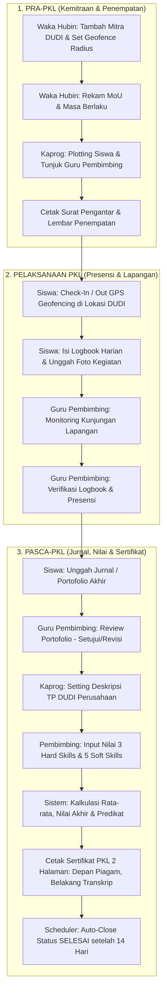

# PANDUAN PENGUJIAN PENERIMAAN PENGGUNA (USER ACCEPTANCE TESTING - UAT)
## MODUL HUBUNGAN INDUSTRI (HUBIN) — SUB-MODUL PRAKTEK KERJA LAPANGAN (PKL)
**Platform Absenta Multi-Tenant Enterprise SaaS**

---

## 1. INFORMASI DOKUMEN

| Parameter | Keterangan |
| :--- | :--- |
| **Nomor Dokumen** | `UAT-ABSENTA-HUBIN-PKL-2026.01` |
| **Modul** | Hubungan Industri (HUBIN) / Kemitraan DUDI |
| **Sub-Modul Utama** | Praktek Kerja Lapangan (PKL) Siklus Penuh |
| **Versi Aplikasi** | Backend v2.4 (Fastify/Prisma) / Frontend Web v2.4 (React/Tailwind) / Mobile App |
| **Tanggal Terbit** | 22 September 2026 |
| **Target Penguji** | Waka Hubin, Ketua Program Keahlian (Kaprog/Kajur), Guru Pembimbing PKL, Perwakilan Siswa PKL, QA / Lead Tester |

---

## 2. RUANG LINGKUP & TUJUAN PENGUJIAN

Dokumen UAT ini dirancang untuk memvalidasi bahwa seluruh fungsi bisnis, alur kerja, validasi anti-fraud, perhitungan akademik Kurikulum Merdeka (Semester 5), serta penerbitan sertifikat PKL telah berjalan sesuai spesifikasi teknis dan kebutuhan operasional sekolah menengah kejuruan (SMK).

### Ruang Lingkup Fitur yang Diuji:
1. **Pendataan Kemitraan DUDI & Legalitas MoU** (Radius geofencing, kuota, masa berlaku).
2. **Plotting & Penempatan Siswa** (Single & Bulk plotting, binding snapshot akademik, isolasi jurusan).
3. **Presensi Geofencing GPS & Logbook Harian Siswa** (Validasi radius 100m, dinas luar, foto bukti, deteksi fake GPS).
4. **Monitoring & Bimbingan Lapangan** (Verifikasi presensi, catatan kunjungan industri pembimbing).
5. **Portofolio & Jurnal Akhir** (Submission file, alur revisi dan persetujuan).
6. **Setting Deskripsi Tujuan Pembelajaran (TP) DUDI** (Manajemen TP oleh Kaprog).
7. **Penilaian Rapor PKL Semester 5** (3 Komponen Hard Skill, 5 Komponen Soft Skill, auto-predikat).
8. **Penerbitan Sertifikat PKL Resmi 2 Halaman** (Halaman 1: Piagam Pernyataan PKL, Halaman 2: Transkrip Nilai & Capaian TP).
9. **Scheduler Otomatisasi & Proteksi Keamanan** (Grace period 14 hari, immutability guard, data isolation).

---

## 3. MATRIKS HAK AKSES PERAN (ROLE & PERMISSIONS)

| Kode Peran | Nama Peran | Hak Akses Utama (Capabilities) | Cakupan Data (Scoping) |
| :--- | :--- | :--- | :--- |
| **HUBIN** | Waka Hubin / Staf Hubin | `hubin.partners.manage`, `hubin.pkl.manage`, `hubin.mou.manage`, `hubin.bkk.manage` | Global Seluruh Sekolah (Tenant-Wide) |
| **KAPROG** | Kepala Program Keahlian | `hubin.pkl.manage`, `hubin.partners.manage`, `hubin.guidance.manage` | Terbatas Siswa & DUDI di Jurusannya Saja |
| **PEMBIMBING**| Guru Pembimbing PKL | `hubin.guidance.manage`, `hubin.absensi.verify`, `hubin.pkl.view.list` | Terbatas Siswa Bimbingan yang Ditugaskan |
| **SISWA** | Siswa Peserta PKL | `hubin.self.pkl`, `hubin.self.logbook`, `hubin.absensi.view.history` | Hanya Data Pribadinya Sendiri |
| **KEPSEK / TU**| Kepala Sekolah & Tata Usaha | `hubin.pkl.view.list`, `report.academic.view` | Read-Only Monitoring & Legalisasi Surat |

---

## 4. END-TO-END WORKFLOW DIAGRAM

---

## 5. SKENARIO & KASUS UJI UAT (TEST CASES)

### BAGIAN A: MANAJEMEN MITRA INDUSTRI (DUDI) & MOU

| Kode UAT | Skenario Pengujian | Peran | Langkah Pengujian | Hasil yang Diharapkan | Status |
| :--- | :--- | :--- | :--- | :--- | :---: |
| **UAT-MITRA-01** | Tambah Mitra DUDI Baru dengan Titik Koordinat GPS | HUBIN | 1. Buka menu Hubin > Mitra Industri. 2. Klik tombol `+ Tambah Mitra`. 3. Isi Nama Perusahaan, Bidang Usaha, Alamat, Kontak PIC. 4. Tentukan Latitude & Longitude kantor mitra dan radius (default 100m). 5. Masukkan Kuota PKL (misal: 5 siswa). 6. Klik Simpan. | Mitra berhasil tersimpan. Koordinat GPS dan radius tersimpan dengan presisi untuk validasi absensi siswa nantinya. | [ ] PASS [ ] FAIL |
| **UAT-MITRA-02** | Rekam MoU dan Validasi Masa Berlaku | HUBIN | 1. Pilih salah satu mitra industri. 2. Buka tab/modal Riwayat MoU. 3. Masukkan No. MoU, tanggal mulai, dan tanggal berakhir (1 tahun ke depan). 4. Unggah berkas dokumen MoU (PDF). 5. Simpan data. | Berkas tersimpan di storage terpusat, status MoU terdeteksi `AKTIF`. Masa berlaku tampil di dashboard mitra. | [ ] PASS [ ] FAIL |
| **UAT-MITRA-03** | Pembatasan Hak Edit Mitra oleh Pembimbing | PEMBIMBING | 1. Login sebagai Guru Pembimbing. 2. Buka data mitra tempat bertugas. 3. Coba ubah nomor telepon PIC atau alamat kantor. 4. Coba ubah nama entitas perusahaan global. | Update kontak PIC sukses. Upaya mengubah nama perusahaan atau menghapus DUDI ditolak / disabled (memerlukan hak akses HUBIN). | [ ] PASS [ ] FAIL |

---

### BAGIAN B: PENEMPATAN & PLOTTING SISWA PKL

| Kode UAT | Skenario Pengujian | Peran | Langkah Pengujian | Hasil yang Diharapkan | Status |
| :--- | :--- | :--- | :--- | :--- | :---: |
| **UAT-PLT-01** | Penempatan Siswa Tunggal (Single Plotting) | KAPROG / HUBIN | 1. Buka menu Penempatan PKL. 2. Klik `+ Tambah Penempatan`. 3. Pilih Siswa (Kelas XI/XII). 4. Pilih Mitra Industri yang memiliki sisa kuota. 5. Pilih Guru Pembimbing. 6. Tentukan tanggal mulai dan selesai PKL. 7. Klik Simpan. | Data tersimpan dengan status `TERDAFTAR` / `AKTIF`. Snapshot akademik (`siswa_akademik_id`) otomatis terikat ke penempatan. Kuota terpakai mitra bertambah. | [ ] PASS [ ] FAIL |
| **UAT-PLT-02** | Penempatan Massal Siswa (Bulk Plotting) | KAPROG | 1. Klik `Plotting Massal`. 2. Filter berdasarkan rombel kelas (misal: XII RPL 1). 3. Pilih 4 siswa sekaligus. 4. Tentukan DUDI tujuan, Guru Pembimbing, dan rentang tanggal. 5. Klik `Proses Penempatan`. | Keempat siswa berhasil ditempatkan dalam 1 transaksi tanpa error. Seluruh siswa terdaftar di bawah guru pembimbing yang sama. | [ ] PASS [ ] FAIL |
| **UAT-PLT-03** | Pencegahan Penempatan Ganda Siswa (Duplicate Guard) | KAPROG / HUBIN | 1. Pilih siswa yang saat ini sedang aktif PKL di PT A. 2. Coba buat penempatan baru untuk siswa tersebut di PT B pada rentang tanggal yang beririsan. | Sistem menolak dengan notifikasi validasi: *"Siswa sudah memiliki penempatan PKL aktif pada periode ini."* | [ ] PASS [ ] FAIL |
| **UAT-PLT-04** | Validasi Isolasi Unit Jurusan (Kaprog Scoping) | KAPROG | 1. Login sebagai Kaprog Jurusan RPL. 2. Buka halaman Penempatan PKL. 3. Amati daftar siswa yang tersedia untuk dipilih. | Hanya siswa jurusan RPL yang muncul. Siswa jurusan lain (TKRO, TBSM, dll.) tidak dapat dilihat maupun dipilih. | [ ] PASS [ ] FAIL |
| **UAT-PLT-05** | Mutasi Siswa PKL ke DUDI Lain | HUBIN | 1. Buka penempatan siswa yang sedang aktif di PT A. 2. Klik tombol `Mutasi Industri`. 3. Pilih DUDI baru (PT B) dan masukkan alasan mutasi. 4. Konfirmasi pemindahan. | Status penempatan lama diarsip/ditutup, penempatan baru di PT B aktif, riwayat mutasi tercatat di audit log. | [ ] PASS [ ] FAIL |

---

### BAGIAN C: PRESENSI GEOFENCING GPS & LOGBOOK HARIAN SISWA

| Kode UAT | Skenario Pengujian | Peran | Langkah Pengujian | Hasil yang Diharapkan | Status |
| :--- | :--- | :--- | :--- | :--- | :---: |
| **UAT-ABS-01** | Check-In Masuk dalam Radius DUDI (Normal) | SISWA | 1. Siswa berada di lokasi industri (< 100m dari koordinat DUDI). 2. Buka menu Absensi PKL di HP / Browser. 3. Izinkan akses lokasi GPS. 4. Unggah foto selfie presensi. 5. Klik tombol `Check-In Sekarang`. | Check-In sukses. Status tercatat `HADIR`, jarak terhitung (misal: 25m), status verifikasi otomatis `TERVERIFIKASI`. Jam masuk tercatat real-time. | [ ] PASS [ ] FAIL |
| **UAT-ABS-02** | Check-In di Luar Radius Tanpa Dinas Luar (Ditolak) | SISWA | 1. Siswa berada di rumah/kost (jarak > 500m dari kantor industri). 2. Buka menu Absensi PKL. 3. Klik Check-In tanpa mencentang opsi Dinas Luar. | Sistem menolak presensi dengan pesan error: *"Anda berada di luar radius lokasi PKL (Jarak Anda: 520m, Maksimal: 100m)."* | [ ] PASS [ ] FAIL |
| **UAT-ABS-03** | Check-In Mode Dinas Luar (Toleransi Penugasan Lapangan) | SISWA | 1. Siswa ditugaskan dinas ke luar kantor mitra. 2. Pada form Check-In, centang opsi `Tugas / Dinas Luar`. 3. Masukkan keterangan lokasi tugas dan unggah foto kegiatan. 4. Klik Check-In. | Presensi berhasil disimpan. Status tercatat `HADIR (DINAS LUAR)`. Status verifikasi berstatus `BELUM_VERIFIKASI` (memerlukan approval pembimbing). | [ ] PASS [ ] FAIL |
| **UAT-ABS-04** | Pengisian Logbook Harian Siswa | SISWA | 1. Setelah Check-In, buka bagian Logbook Hari Ini. 2. Tuliskan rincian kegiatan pekerjaan teknis yang dilakukan. 3. Unggah 1-2 foto dokumentasi pekerjaan. 4. Klik `Simpan Logbook`. | Logbook harian terikat dengan presensi hari tersebut. Pembimbing dapat melihat jurnal kegiatan siswa secara real-time. | [ ] PASS [ ] FAIL |
| **UAT-ABS-05** | Check-Out Kepulangan Siswa | SISWA | 1. Pada sore hari jam pulang PKL, buka halaman Absensi PKL. 2. Pastikan berada dalam radius kantor. 3. Klik `Check-Out Pulang`. | Jam keluar tercatat. Status presensi hari itu lengkap (Masuk & Pulang). Durasi kerja terekam. | [ ] PASS [ ] FAIL |
| **UAT-ABS-06** | Pengajuan Izin / Sakit PKL | SISWA | 1. Buka Absensi PKL > Pengajuan Ketidakhadiran. 2. Pilih jenis `SAKIT` atau `IZIN`. 3. Masukkan alasan dan unggah surat keterangan dokter / surat izin. 4. Kirim pengajuan. | Status kehadiran hari itu menjadi `SAKIT` atau `IZIN`. Guru pembimbing menerima notifikasi untuk verifikasi. | [ ] PASS [ ] FAIL |

---

### BAGIAN D: MONITORING & BIMBINGAN OLEH GURU PEMBIMBING

| Kode UAT | Skenario Pengujian | Peran | Langkah Pengujian | Hasil yang Diharapkan | Status |
| :--- | :--- | :--- | :--- | :--- | :---: |
| **UAT-MON-01** | Akses Menu Khusus Guru Pembimbing | PEMBIMBING | 1. Login akun guru yang ditugaskan sebagai pembimbing PKL. 2. Periksa Beranda dan Dashboard Staf. 3. Periksa menu Monitoring PKL. | Subtitle profil menampilkan *"Pembimbing PKL"*. Widget monitoring PKL tampil hanya memuat siswa bimbingannya (tidak memuat siswa guru lain). | [ ] PASS [ ] FAIL |
| **UAT-MON-02** | Verifikasi Presensi Dinas Luar oleh Pembimbing | PEMBIMBING | 1. Buka tab Presensi Siswa Bimbingan. 2. Temukan record presensi siswa berstatus `BELUM_VERIFIKASI` (Dinas Luar). 3. Periksa foto dan lokasi yang dikirimkan siswa. 4. Klik tombol `Verifikasi Presensi`. | Status presensi berubah menjadi `TERVERIFIKASI`. Tanggal dan identitas verifikator tercatat. | [ ] PASS [ ] FAIL |
| **UAT-MON-03** | Pencatatan Kunjungan Monitoring Lapangan | PEMBIMBING | 1. Buka menu Monitoring PKL > Kunjungan Industri. 2. Pilih Mitra Industri yang dikunjungi. 3. Masukkan tanggal kunjungan, nama instruktur industri yang ditemui. 4. Masukkan catatan evaluasi kemajuan siswa & kendala lapangan. 5. Unggah foto bukti kunjungan. 6. Klik Simpan. | Riwayat kunjungan tersimpan di log monitoring. Menghasilkan bukti administrasi kunjungan PKL yang dapat dicetak. | [ ] PASS [ ] FAIL |

---

### BAGIAN E: JURNAL PORTOFOLIO AKHIR PKL

| Kode UAT | Skenario Pengujian | Peran | Langkah Pengujian | Hasil yang Diharapkan | Status |
| :--- | :--- | :--- | :--- | :--- | :---: |
| **UAT-JRN-01** | Unggah Laporan / Portofolio Akhir Siswa | SISWA | 1. Menjelang akhir masa PKL, buka menu Jurnal Akhir. 2. Unggah file dokumen laporan PKL (PDF, max 10MB). 3. Masukkan ringkasan proyek / tugas utama. 4. Klik Kirim Jurnal Akhir. | Berkas terunggah ke storage cloud/lokal. Status portofolio menjadi `MENUNGGU_REVIEW`. | [ ] PASS [ ] FAIL |
| **UAT-JRN-02** | Review dan Permintaan Revisi Portofolio | PEMBIMBING | 1. Buka Portofolio siswa di menu Monitoring PKL. 2. Unduh dan baca file laporan siswa. 3. Klik `Minta Revisi`. 4. Berikan catatan catatan bagian bab yang perlu diperbaiki. 5. Kirim ulasan. | Status portofolio berubah menjadi `REVISI`. Siswa menerima notifikasi dan tombol unggah ulang aktif kembali. | [ ] PASS [ ] FAIL |
| **UAT-JRN-03** | Persetujuan (Approval) Portofolio Akhir | PEMBIMBING | 1. Buka laporan yang telah diperbaiki siswa. 2. Klik tombol `Setujui Portofolio`. | Status portofolio menjadi `DISETUJUI`. Menjadi syarat pembuka untuk input nilai akhir PKL. | [ ] PASS [ ] FAIL |

---

### BAGIAN F: SETTING DESKRIPSI TP DUDI & RAPOR NILAI PKL SEMESTER 5

| Kode UAT | Skenario Pengujian | Peran | Langkah Pengujian | Hasil yang Diharapkan | Status |
| :--- | :--- | :--- | :--- | :--- | :---: |
| **UAT-RAPOR-01**| Setting Deskripsi Tujuan Pembelajaran (TP) DUDI | KAPROG | 1. Buka menu Hubin > Pengaturan TP DUDI. 2. Pilih Mitra Industri (misal: PT Solusi Teknologi). 3. Masukkan rumusan Capaian TP Kompetensi Teknis dan Soft Skill spesifik tempat PKL tersebut. 4. Klik Simpan. | Deskripsi TP tersimpan dan otomatis menjadi template deskripsi rapor transkrip siswa yang magang di industri tersebut. | [ ] PASS [ ] FAIL |
| **UAT-RAPOR-02**| Pengisian 3 Komponen Hard Skill Siswa | PEMBIMBING | 1. Buka menu Input Nilai PKL (Semester 5). 2. Pilih siswa bimbingan. 3. Input nilai (skala 0 - 100):    - Kompetensi Teknis (misal: 88)    - Pemahaman SOP & K3LH (misal: 90)    - Pemahaman Alur Bisnis Industri (misal: 85) | Sub-total rata-rata Hard Skill terkalkulasi otomatis (87.67) secara real-time tanpa reload halaman. | [ ] PASS [ ] FAIL |
| **UAT-RAPOR-03**| Pengisian 5 Komponen Soft Skill Siswa | PEMBIMBING | 1. Lanjutkan pengisian pada siswa yang sama:    - Disiplin & Integritas (misal: 92)    - Inisiatif & Kreativitas (misal: 88)    - Kerjasama Tim (Teamwork) (misal: 90)    - Kejujuran (misal: 95)    - Tanggung Jawab (misal: 90) | Sub-total rata-rata Soft Skill terkalkulasi otomatis (91.00). | [ ] PASS [ ] FAIL |
| **UAT-RAPOR-04**| Formula Nilai Akhir PKL & Konversi Predikat Otomatis | PEMBIMBING / SISTEM | 1. Amati field Nilai Akhir PKL dan Predikat. 2. Nilai Akhir terhitung = `(Rata2 Hard Skill + Rata2 Soft Skill) / 2` = `(87.67 + 91.00) / 2 = 89.33`. 3. Cek konversi Predikat. | Nilai akhir `89.33` otomatis menghasilkan Predikat `Baik (B)`. Jika >= 90 otomatis menjadi `Sangat Baik (A)`. | [ ] PASS [ ] FAIL |
| **UAT-RAPOR-05**| Finalisasi Nilai & Immutability Guard | PEMBIMBING | 1. Klik `Simpan & Finalisasi Nilai`. 2. Setelah tersimpan, periksa integrasi ke Ledger Nilai Rapor Semester 5. | Nilai berhasil disinkronkan ke rekap rapor semester ganjil kelas XII. Data terkunci dari perubahan sembarangan. | [ ] PASS [ ] FAIL |

---

### BAGIAN G: PENERBITAN & CETAK SERTIFIKAT PKL RESMI (2 HALAMAN)

| Kode UAT | Skenario Pengujian | Peran | Langkah Pengujian | Hasil yang Diharapkan | Status |
| :--- | :--- | :--- | :--- | :--- | :---: |
| **UAT-SRT-01** | Preview Sertifikat Halaman 1 (Piagam Pernyataan PKL) | PEMBIMBING / HUBIN | 1. Buka data siswa yang sudah memiliki nilai final. 2. Klik tombol `Cetak Sertifikat PKL`. 3. Periksa tampilan lembar depan. | Lembar depan menampilkan bingkai resmi (border piagam), Kop Sekolah, Nomor Sertifikat otomatis (`.../PKL/HUBIN/...`), identitas siswa, nama DUDI, dan masa pelaksanaan PKL. TTD Kepala Sekolah & Pimpinan DUDI tersedia. | [ ] PASS [ ] FAIL |
| **UAT-SRT-02** | Preview Sertifikat Halaman 2 (Transkrip Rincian Nilai & TP) | PEMBIMBING / HUBIN | 1. Periksa halaman ke-2 (belakang sertifikat). 2. Periksa tabel rincian nilai. | Tabel menampilkan rincian nilai 3 Aspek Hard Skill, 5 Aspek Soft Skill, Nilai Akhir, Predikat, serta Deskripsi Capaian Kompetensi TP DUDI yang terformat rapi. | [ ] PASS [ ] FAIL |
| **UAT-SRT-03** | Cetak Fisik / Simpan PDF Ukuran Standar (A4 Landscape) | HUBIN / KEPSEK | 1. Klik tombol `Print / Unduh PDF`. 2. Periksa layout cetak browser. | Dokumen siap cetak dalam orientasi A4 Landscape, tanpa halaman kosong tambahan, margin presisi, dan resolusi tajam. | [ ] PASS [ ] FAIL |

---

### BAGIAN H: KEAMANAN, ANTI-FRAUD & INTEGRITAS SISTEM (NEGATIVE CASES)

| Kode UAT | Skenario Pengujian | Peran | Langkah Pengujian | Hasil yang Diharapkan | Status |
| :--- | :--- | :--- | :--- | :--- | :---: |
| **UAT-SEC-01** | Deteksi Fake GPS / Mock Location | SISWA | 1. Siswa menggunakan aplikasi Fake GPS (akurasi dilaporkan 0.0m atau anomali drastis). 2. Coba lakukan Check-In. | Sistem mendeteksi `accuracy < 1m` sebagai anomali, mencatat peringatan `SUSPICIOUS_GPS` di log audit, dan status presensi otomatis ditandai untuk review pembimbing. | [ ] PASS [ ] FAIL |
| **UAT-SEC-02** | Akses Data Siswa Lulus / Alumni (Academic Snapshot) | HUBIN | 1. Siswa telah menyelesaikan PKL dan berstatus `LULUS`. 2. Buka arsip sertifikat atau laporan nilai PKL siswa tersebut di tahun ajaran berikutnya. | Data nilai, nama kelas saat PKL, dan sertifikat tetap utuh tanpa error `null relationship` berkat binding snapshot akademik. | [ ] PASS [ ] FAIL |
| **UAT-SEC-03** | Isolasi Multi-Tenant (Cross-Tenant Access Prevention) | HACKER / TESTER | 1. Menggunakan akun Tenant A, coba panggil API endpoint `/hubin/penempatan/:id` dengan ID penempatan milik Tenant B. | Sistem menolak permintaan dengan kode HTTP `403 Forbidden` atau `404 Not Found`. Tidak ada kebocoran data antar-sekolah. | [ ] PASS [ ] FAIL |
| **UAT-SEC-04** | Proteksi Nilai di Luar Batas Valid (Range Guard 0-100) | PEMBIMBING | 1. Masukkan nilai negatif (misal: `-10`) atau di atas 100 (misal: `105`). 2. Klik simpan. | Zod schema validasi memblokir input dengan pesan error: *"Nilai harus berada di antara 0 sampai 100."* | [ ] PASS [ ] FAIL |

---

### BAGIAN I: BACKGROUND SCHEDULER & CACHE PERFORMANCE

| Kode UAT | Skenario Pengujian | Peran | Langkah Pengujian | Hasil yang Diharapkan | Status |
| :--- | :--- | :--- | :--- | :--- | :---: |
| **UAT-SYS-01** | Auto-Close Penempatan PKL (Grace Period 14 Hari) | SISTEM (CRON) | 1. Buat data siswa PKL dengan `tanggal_selesai` 15 hari yang lalu dan nilai akhir sudah terisi lengkap. 2. Jalankan background job `pkl-status-scheduler`. | Status penempatan siswa otomatis berubah dari `AKTIF` menjadi `SELESAI`. Log scheduler mencatat update berhasil. | [ ] PASS [ ] FAIL |
| **UAT-SYS-02** | Invalidation Cache Redis Saat Nilai Berubah | SISTEM | 1. Akses halaman rekap sertifikat siswa (cache tersimpan di Redis `HUBIN.PKL_SERTIFIKAT`). 2. Update nilai siswa. 3. Panggil ulang endpoint sertifikat. | Cache lama otomatis ter-invalidasi, respon baru mengembalikan data terupdate seketika tanpa perlu restart service. | [ ] PASS [ ] FAIL |

---

## 6. LEMBAR PERSETUJUAN HASIL UAT (SIGN-OFF MATRIX)

Pengujian User Acceptance Testing (UAT) modul HUBIN Sub-Modul PKL dinyatakan:
* [ ] **DITERIMA PENUH (GO-LIVE READY)**: Seluruh skenario kritis (P0 & P1) berstatus PASS tanpa kendala pemblokir.
* [ ] **DITERIMA BERSYARAT**: Terdapat catatan minor (P2/P3) yang tidak menghambat operasional dan akan diperbaiki pada patch berikutnya.
* [ ] **DITOLAK**: Terdapat kendala kritis pada alur penempatan, presensi geofencing, atau kalkulasi nilai rapor.

### Tanda Tangan Stakeholder Penguji:

| No | Peran Penguji | Nama Lengkap | Jabatan | Tanda Tangan | Tanggal |
| :-: | :--- | :--- | :--- | :---: | :---: |
| 1 | **Lead Quality Assurance** | .................................................... | QA Engineer | ______________ | ___ / ___ / 2026 |
| 2 | **Waka Hubungan Industri** | .................................................... | Koordinator HUBIN | ______________ | ___ / ___ / 2026 |
| 3 | **Perwakilan Kaprog** | .................................................... | Kepala Program RPL | ______________ | ___ / ___ / 2026 |
| 4 | **Perwakilan Guru Pembimbing**| .................................................... | Pembimbing PKL | ______________ | ___ / ___ / 2026 |
| 5 | **Product Owner / Lead Dev**| .................................................... | Technical Architect | ______________ | ___ / ___ / 2026 |
