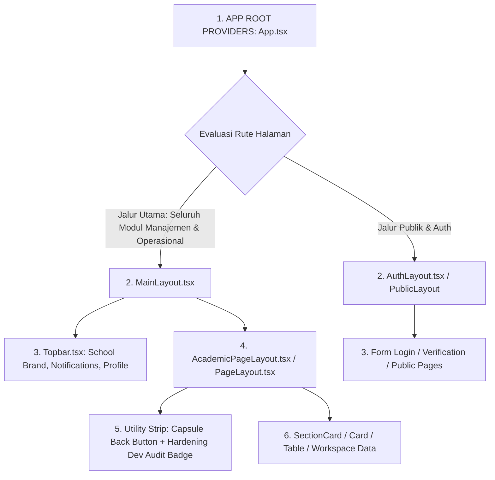

# 🏛️ PANDUAN ARSITEKTUR LAYOUT & HIRARKI PLATFORM ABSENTA.ID

Dokumen ini merupakan panduan resmi platform Absenta.id yang mendokumentasikan hirarki dan arsitektur tata letak (*layout*) dari lapisan paling luar (*Root Router*) hingga ke lapisan paling dalam (*Content Component*). Gunakan dokumen ini sebagai acuan standar bagi seluruh pengembang (manusia dan AI) dalam mengimplementasikan layout halaman.

---

## 📊 ARSITEKTUR TUNGGAL: UNIFIED FULL-SCREEN PORTAL & APP LAUNCHER

Platform Absenta.id telah beralih 100% ke arsitektur modern **Unified Full-Screen Portal Mode**. Sidebar vertikal statis telah dipensiunkan demi pengalaman layar penuh 100% berbasis **App Launcher Hub** di setiap dashboard modul.



---

## 🟢 JALUR UTAMA: UNIFIED FULL-SCREEN PORTAL LAYOUT

### 1. Karakteristik & Kasus Penggunaan
* **Tujuan**: Digunakan oleh **100% halaman modul aplikasi** (Manajemen Data, Presensi Operasional, Meja Piket Guru, Jadwal Builder, Monitoring Kesiswaan, Input Nilai Rapor, WhatsApp Gateway, Analitik, & Pengaturan).
* **Ciri Khas**:
  * **100% Layar Penuh (Zero Noise & Zero Sidebar):** Navigasi antar modul dilakukan melalui App Launcher Hub terpusat di dashboard dan Topbar.
  * **Unified Nav & Audit Strip:** Setiap halaman memiliki bilah utilitas di bagian paling atas yang memuat tombol kembali Apple-style Glass Capsule `[ ‹ Kembali ]` berdampingan dengan interactive badge **Hardening Dev Audit**.
  * **Isolated Error Boundary:** Dilindungi oleh `InfraErrorBoundary` layout-level untuk menjamin zero-blank-screen resilience.
* **Komponen Utama**: `<AcademicPageLayout>` atau `<PageLayout>` di dalam `<MainLayout>`.

### 2. Hirarki Lapisan Lapisan
1. `App.tsx` *(Root Provider & React Router terproteksi)*
2. `MainLayout.tsx` *(Pembungkus Utama yang memuat Topbar, Floating Messenger, & Global Contexts)*
3. `Topbar.tsx` *(Header Atas: Identitas Sekolah, Jam, Notifikasi, Mode Switch, Profile)*
4. `AcademicPageLayout.tsx` *(Bilah Utilitas: Tombol Kembali + Hardening Inspector + Toolbar + Error Boundary)*
5. `SectionCard` / `Card` / `Table` *(Area Kerja & Konten Utama Halaman)*

### 3. Wireframe Visual
```
+-------------------------------------------------------------------------+
| 1. APP ROOT PROVIDERS (App.tsx)                                         |
| +---------------------------------------------------------------------+ |
| | 2. MAIN LAYOUT (MainLayout.tsx)                                     | |
| | +-----------------------------------------------------------------+ | |
| | | 3. TOPBAR MANAGEMENT (Header Identitas Sekolah, Notif, Profil)  | | |
| | +-----------------------------------------------------------------+ | |
| | | 4. ACADEMIC PAGE LAYOUT (AcademicPageLayout.tsx)                | | |
| | | +-------------------------------------------------------------+ | | |
| | | | [ ‹ Kembali ]  [ 🟠 DEV AUDIT BADGE ]    [ 🔍 Filter/Toolbar] | | | |
| | | +-------------------------------------------------------------+ | | |
| | | | TopSlot: Workspace App Launcher (Opsional)                  | | | |
| | | +-------------------------------------------------------------+ | | |
| | | | 5. KONTEN UTAMA (SectionCard / Card / Table Data / Workspace)| | | |
| | | +-------------------------------------------------------------+ | | |
| | +-----------------------------------------------------------------+ | |
| +---------------------------------------------------------------------+ |
+-------------------------------------------------------------------------+
```

---

## 🟡 JALUR AUTENTIKASI & PUBLIK

### 1. Karakteristik & Kasus Penggunaan
* **Tujuan**: Halaman Login, Lupa Password, Reset Password, SIPLaH Audit Verification, Landing Page.
* **Komponen Utama**: `<AuthLayout>` / Public Container.

---

## ⚙️ ATURAN PENDAFTARAN RUTE DI `src/App.tsx` (HARDENING PILAR 1)

1. **Seluruh Halaman Modul Wajib Berada di Bawah `<MainLayout>`**:
   ```tsx
   <Route element={<RequireAuth><MainLayout /></RequireAuth>}>
     <Route path="/academic/siswa" element={<SiswaPage />} />
     <Route path="/attendance/ops" element={<AttendanceOpsPage />} />
     <Route path="/kesiswaan/piket" element={<PiketPage />} />
     <Route path="/kurikulum/jadwal" element={<JadwalPelajaranPage />} />
     <Route path="/rapor/nilai" element={<InputNilaiPage />} />
     <Route path="/notifications/wa-chat-logs" element={<WhatsAppChatLogPage />} />
   </Route>
   ```

2. **Dilarang Menggunakan Layout Khusus Terfragmentasi**:
   * Komponen `OperationalPageLayout.tsx` telah resmi dihapus dan digantikan seutuhnya oleh `AcademicPageLayout.tsx`.
   * Seluruh mesin audit statis (`audit-pages.cjs`) dan audit realtime (`dev-audit-server.cjs`) memvalidasi kepatuhan halaman terhadap standar tunggal `AcademicPageLayout` dan `PageLayout`.

---

## 📱 DASHBOARD DUAL MODE — UNIFIED STAFF DASHBOARD

Dashboard staf (`/dashboard`) mendukung dua mode tampilan yang dapat di-toggle kapan saja:

### Mode Portal Apps 📱 (`mode = 'app-launcher'`)
- Tampilan grid ikon squircle bergaya Modern Web OS.
- Menampilkan `StaffPortalAppLauncher.tsx` — komponen 3-Blok Menu unik terdeduplikasi:
  1. **⚡ Blok 1 — Aksi Cepat**: Pintasan kontekstual dari `quickActions` (dinamis by role).
  2. **🏫 Blok 2 — Ruang Kerja Guru & Wali Kelas**: Operasional harian pengajaran & rombel.
  3. **🏛️ Blok 3 — Ruang Kerja Jabatan & Lintas Modul**: Menu RBAC dari API backend (`useSmartMenu`).

### Mode Desktop 🖥️ (`mode = 'desktop'`)
- Tampilan multi-kolom dengan widget, card statistik, dan informasi operasional.
- Menampilkan dashboard widget klasik.

---

## 🧩 CENTRALIZED WORKSPACE NAVIGATION FILTER

### Lokasi
`src/helpers/workspaceNavFilter.ts` — **Single Source of Truth** untuk logika penyaringan menu berbasis workspace.

### Ekspor
| Fungsi | Kegunaan |
|---|---|
| `isAdminUser(user)` | Cek apakah user adalah admin/superadmin |
| `filterNavByWorkspace(allItems, user, workspaceId)` | Filter menu flat berdasarkan workspace aktif |
| `normalizeFlatMenu(backendGroupedMenu)` | Konversi grouped-menu API → FlatMenuItem[] |

---
*Dokumen ini diperbarui secara otomatis dan dijadikan acuan standar arsitektur platform Absenta.id.*
*Terakhir diperbarui: 2026-08-19 — Penyatuan Standar Tunggal AcademicPageLayout & Pemusnahan OperationalPageLayout.*
