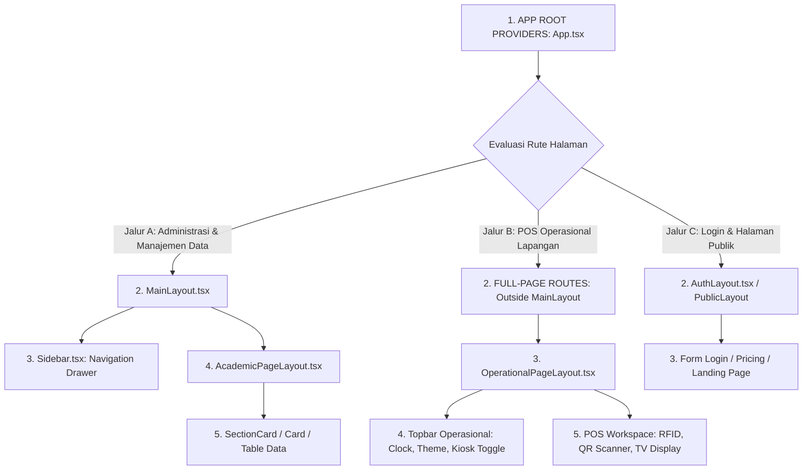

# 🏛️ PANDUAN ARSITEKTUR LAYOUT & HIRARKI PLATFORM ABSENTA.ID

Dokumen ini merupakan panduan resmi platform Absenta.id yang mendokumentasikan hirarki dan arsitektur tata letak (*layout*) dari lapisan paling luar (*Root Router*) hingga ke lapisan paling dalam (*Content Component*). Gunakan dokumen ini sebagai acuan standar bagi seluruh pengembang (manusia dan AI) dalam memilih dan mengimplementasikan layout halaman.

---

## 📊 ARSITEKTUR 3 JALUR UTAMA LAYOUT

Seluruh halaman di dalam platform Absenta.id diklasifikasikan ke dalam **3 Jalur Utama Layout**:



---

## 🟢 JALUR A: LAYOUT MANAJEMEN & ADMINISTRASI (DENGAN SIDEBAR)

### 1. Karakteristik & Kasus Penggunaan
* **Tujuan**: Untuk 90% halaman berorientasi pada **Pengaturan, Pengelolaan Data (CRUD), Plotting Rombel/Guru, Pelaporan, dan Analitik**.
* **Ciri Khas**: Pengguna bekerja secara *multi-tasking* dan membutuhkan menu navigasi samping (`Sidebar.tsx`) untuk berpindah antar modul dengan cepat.
* **Komponen Utama**: `<AcademicPageLayout>` dibungkus oleh `<MainLayout>`.

### 2. Hirarki Lapisan Lapisan
1. `App.tsx` *(Root Provider & React Router)*
2. `MainLayout.tsx` *(Pembungkus Utama yang memuat Sidebar & Navbar)*
3. `Sidebar.tsx` *(Menu Navigasi Samping Kiri)*
4. `AcademicPageLayout.tsx` *(Header Breadcrumbs, Filter Bar, & AnalyticsCard Grid)*
5. `SectionCard` / `Card` / `Table` *(Konten Utama Tabel & Form Data)*

### 3. Wireframe Visual Jalur A
```
+-------------------------------------------------------------------------+
| 1. APP ROOT PROVIDERS (App.tsx)                                         |
| +---------------------------------------------------------------------+ |
| | 2. MAIN LAYOUT (MainLayout.tsx)                                     | |
| | +--------------+ +------------------------------------------------+ | |
| | |              | | TOPBAR MANAGEMENT (Header Navigasi Atas)       | | |
| | |              | +------------------------------------------------+ | |
| | |              | | 4. ACADEMIC PAGE LAYOUT (AcademicPageLayout)   | | |
| | | 3. SIDEBAR   | | +--------------------------------------------+ | | |
| | |    NAVIGATION| | | Breadcrumbs & Header Judul Halaman         | | | |
| | |   (Sidebar)  | | +--------------------------------------------+ | | |
| | |              | | | Grid Ringkasan Kartu Statistik (Analytics) | | | |
| | |              | | +--------------------------------------------+ | | |
| | |              | | | 5. KONTEN UTAMA (SectionCard / Table Data) | | | |
| | |              | | +--------------------------------------------+ | | |
| | +--------------+ +------------------------------------------------+ | |
| +---------------------------------------------------------------------+ |
+-------------------------------------------------------------------------+
```

---

## 🔵 JALUR B: LAYOUT POS OPERASIONAL REAL-TIME (TANPA SIDEBAR / 100% LAYAR PENUH)

### 1. Karakteristik & Kasus Penggunaan
* **Tujuan**: Khusus halaman **Pos Eksekusi Lapangan Intensif & Kiosk Display** (Meja Piket RFID/QR, Kiosk TV Monitoring Disiplin, POS Kasir Koperasi, Pos Satpam Gerbang).
* **Ciri Khas**: **0% Sidebar (Zero Distraction)**. Memberikan 100% ruang layar penuh agar petugas fokus pada alat scanner/RFID/layar sentuh tanpa terganggu menu navigasi samping.
* **Komponen Utama**: `<OperationalPageLayout>` didaftarkan di bagian **`FULL-PAGE ROUTES`** (di luar `MainLayout`) di `src/App.tsx`.

### 2. Hirarki Lapisan Lapisan
1. `App.tsx` *(Rute didaftarkan di bagian FULL-PAGE ROUTES di luar MainLayout)*
2. `OperationalPageLayout.tsx` *(Layout Operasional Layar Penuh)*
3. `Operational Topbar` *(Header Khusus: Kembali, Judul Ringkas, Jam Digital WIB, Theme Toggle, Kiosk Mode)*
4. `Mobile-Mini Stats Bar` *(Ringkasan statistik ringkas 52px)*
5. `POS Workspace` *(Area kerja scanner RFID, kamera QR, & input transaksi)*

### 3. Wireframe Visual Jalur B
```
+-------------------------------------------------------------------------+
| 1. APP ROOT PROVIDERS (App.tsx)                                         |
| +---------------------------------------------------------------------+ |
| | 2. FULL-PAGE ROUTES / NO MAINLAYOUT (Di Luar MainLayout di App.tsx) | |
| | +-----------------------------------------------------------------+ | |
| | | 3. OPERATIONAL PAGE LAYOUT (OperationalPageLayout.tsx)          | | |
| | | +-------------------------------------------------------------+ | | |
| | | | 4. TOPBAR OPERASIONAL (Judul, Jam WIB, Theme, Kiosk Toggle) | | | |
| | | +-------------------------------------------------------------+ | | |
| | | | Grid Ringkasan Statistik (Collapsible Mobile-Mini 52px)     | | | |
| | | +-------------------------------------------------------------+ | | |
| | | | 5. AREA WORKSPACE POS (Scan RFID, QR Kamera, Input Data)    | | | |
| | | +-------------------------------------------------------------+ | | |
| | +-----------------------------------------------------------------+ | |
| +---------------------------------------------------------------------+ |
+-------------------------------------------------------------------------+
```

---

## 🟡 JALUR C: LAYOUT OTENTIKASI & PUBLIK

### 1. Karakteristik & Kasus Penggunaan
* **Tujuan**: Halaman Login, Lupa Password, Reset Password, Landing Page, Pricing, Terms of Service, DPA.
* **Komponen Utama**: `<AuthLayout>` / Public Layout Container.

---

---
## ⚙️ ATURAN PENDAFTARAN RUTE DI `src/App.tsx` (HARDENING PILAR 1)

Setiap pengembang wajib mematuhi aturan pendaftaran rute berikut:

1. **Jika Halaman Menggunakan `<AcademicPageLayout>`**:
   * Wajib didaftarkan di dalam rute terproteksi yang dibungkus `<MainLayout>`:
     ```tsx
     <Route path="/" element={<MainLayout />}>
       <Route path="/academic/siswa" element={<SiswaPage />} />
     </Route>
     ```

2. **Jika Halaman Menggunakan `<OperationalPageLayout>`**:
   * **WAJIB HUKUMNYA** didaftarkan di bagian `/* ── FULL-PAGE ROUTES (No Sidebar / No MainLayout) ── */` di luar `<MainLayout>`:
     ```tsx
     {/* ── FULL-PAGE ROUTES (No Sidebar / No MainLayout) ── */}
     <Route path="/kesiswaan/piket" element={<PiketPage />} />
     <Route path="/kesiswaan/monitoring" element={<MonitoringKesiswaanPage />} />
     ```

3. **Enforcement Mesin Audit (Pilar 1 - Layout Standard Guard)**:
   * Mesin audit (`scripts/audit-pages.cjs` & `scripts/dev-audit-server.cjs`) secara otomatis memverifikasi bahwa apabila suatu komponen menggunakan `<OperationalPageLayout>`, rutenya di `App.tsx` **harus berada di bawah FULL-PAGE ROUTES**. Jika tidak, audit Pilar 1 akan menandai `FAILED`.

---

## 📱 DASHBOARD DUAL MODE — UNIFIED STAFF DASHBOARD

Dashboard staf (`/dashboard`) mendukung dua mode tampilan yang dapat di-toggle kapan saja:

### Mode Portal Apps 📱 (`mode = 'app-launcher'`)
- Tampilan grid ikon squircle bergaya Android/iOS.
- Menampilkan `StaffPortalAppLauncher.tsx` — komponen 3-Blok Menu unik terdeduplikasi:
  1. **⚡ Blok 1 — Aksi Cepat**: Pintasan kontekstual dari `quickActions` (dinamis by role).
  2. **🏫 Blok 2 — Ruang Kerja Guru & Wali Kelas**: Operasional harian pengajaran & rombel.
  3. **🏛️ Blok 3 — Ruang Kerja Jabatan & Lintas Modul**: Menu RBAC dari API backend (`useSmartMenu`).

### Mode Desktop 🖥️ (`mode = 'desktop'`)
- Tampilan multi-kolom dengan widget, card statistik, dan informasi operasional.
- Menampilkan dashboard widget klasik.

### Mekanisme Sinkronisasi Global
```
LocalStorage: absenta_dashboard_mode ('app-launcher' | 'desktop')
     ↕ dibaca/ditulis via
Custom Event: 'absenta-dashboard-mode-change'
     ↕ didengarkan oleh
├── Topbar.tsx          → tombol toggle (single source, proxy handler)
├── UnifiedStaffDashboard.tsx → re-render konten
└── MainLayout.tsx      → kondisional styling wrapper
```

**Aturan**: Satu tombol switch hanya boleh ada di `Topbar.tsx`. Tombol lain mana pun yang berfungsi switch mode **wajib** memancarkan Custom Event yang sama, tidak boleh memiliki handler state sendiri.

---

## 🧩 CENTRALIZED WORKSPACE NAVIGATION FILTER

### Lokasi
`src/helpers/workspaceNavFilter.ts` — **Single Source of Truth** untuk logika penyaringan menu berbasis workspace.

### Ekspor
| Fungsi | Kegunaan |
|---|---|
| `isAdminUser(user)` | Cek apakah user adalah admin/superadmin |
| `filterNavByWorkspace(allItems, user, workspaceId)` | Filter menu flat berdasarkan workspace aktif |
| `normalizeFlatMenu(backendGroupedMenu)` | Konversi grouped-menu API → FlatMenuItem[] |

### Alur Penggunaan
```
API /api/menu/sidebar (useSmartMenu)
    ↓ normalizeFlatMenu()
FlatMenuItem[]
    ↓ filterNavByWorkspace(items, user, activeWorkspaceId)
{ primaryItems, crossModuleItems, allAllowedItems }
    ↓ dikonsumsi oleh
├── StaffPortalAppLauncher.tsx (Blok 3) ← sudah diimport ✅
└── Sidebar.tsx (getFilteredNavigation) ← kandidat refactor berikutnya
```

### Aturan
- **JANGAN** menduplikasi logika workspace filtering di file lain.
- **SELALU** tambahkan workspace baru di `ROLE_WORKSPACES` (`navigation.config.ts`) dan `filterNavByWorkspace()` di helper ini secara bersamaan.

---
*Dokumen ini diperbarui secara otomatis dan dijadikan acuan standar arsitektur platform Absenta.id.*
*Terakhir diperbarui: 2026-08-01 — Penambahan Dashboard Dual Mode & Centralized Navigation Filter.*
